# **Arquitetura Escalável do WordPress na AWS com Application Load Balancer e Auto Scaling**


1. Resumo 
   
Este documento detalha a implementação de uma arquitetura web robusta e escalável utilizando serviços da Amazon Web Services (AWS). O objetivo principal deste projeto é criar um ambiente para hospedar uma aplicação WordPress, incorporando princípios de alta disponibilidade, balanceamento de carga e escalabilidade automática, conforme o diagrama de arquitetura previamente definido.

A solução proposta envolve a utilização de componentes chave da AWS, incluindo o Virtual Private Cloud (VPC) para isolamento da rede, o Amazon Relational Database Service (RDS) para um banco de dados MySQL gerenciado, instâncias Elastic Compute Cloud (EC2) para hospedar a aplicação WordPress conteinerizada com Docker, um Application Load Balancer (ALB) para distribuir o tráfego de forma eficiente, e um Auto Scaling Group (ASG) para ajustar dinamicamente a capacidade das instâncias EC2 em resposta à demanda.

Este documento guiará o leitor através do processo de configuração de cada um desses componentes, desde a criação da infraestrutura de rede até a implantação e teste da aplicação WordPress. O intuito é fornecer um guia prático e abrangente para a construção de uma aplicação web resiliente e capaz de lidar com variações de carga, seguindo as melhores práticas de arquitetura na nuvem.

2. Tecnologias Utilizadas
   
- GitHub 
- Amazon Web Services 
- Visual Studio Code
- Docker
- Wordpress
  
3. Objetivos
   

Este projeto visa criar uma plataforma WordPress escalável, de alta disponibilidade e resiliente na AWS, e tem como objetivo final é hospedar o WordPress de forma eficiente, otimizar custos e garantir a capacidade da aplicação de lidar com variações de tráfego

4. Passo a Passo 
   
## Criando uma VPC

Para criar uma VPC na AWS, é necessário acessar a página inicial do console da AWS e localizar a opção VPC na tela inicial, ou buscá-la na barra de pesquisas.

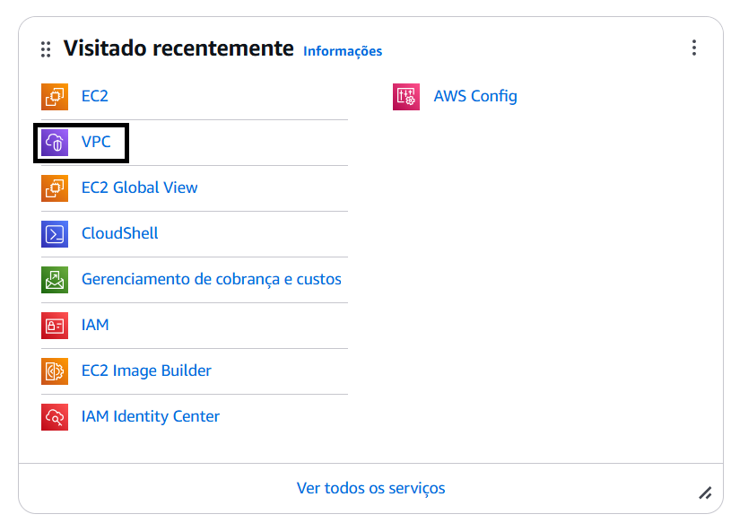

Logo depois clicamos em Criar VPC

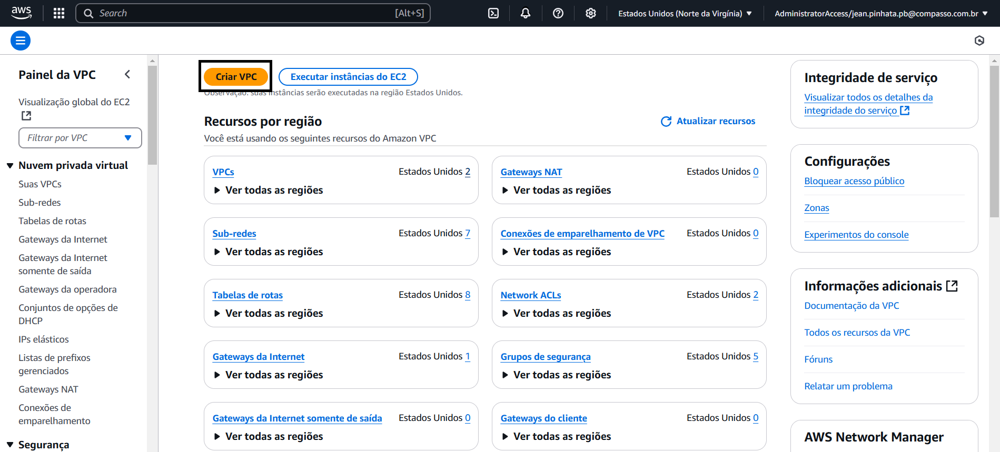

Agora faremos as configurações da nossa VPC. Marcamos o campo VPC e muito mais, escolhemos o nome que desejamos, conforme pede o projeto vamos configurar duas sub-redes públicas e duas privadas, em Nat Gateway selecionaremos a opção de 1 por AZ e então clicamos em criar VPC.

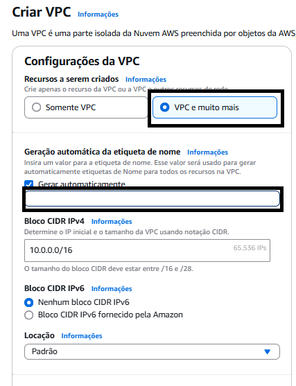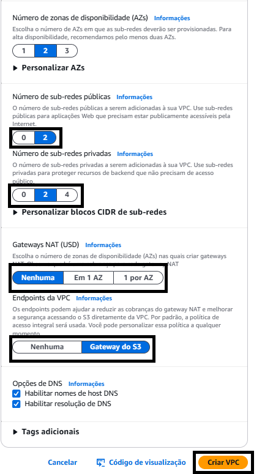

Então faremos a configuração dos nossos grupos de segurança (Security Group). Para tal iremos no menu lateral a esquerda da tela e iremos selecionar a opção Grupos de Segurança. Seremos direcionados para uma nova página e clicaremos no botão Criar grupo de segurança na parte superior do lado direito da tela.

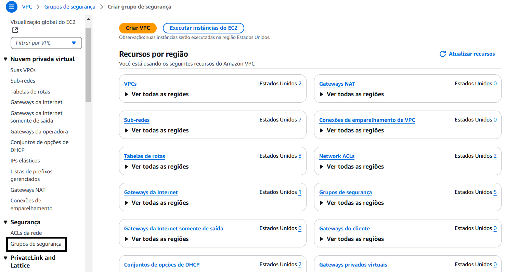

Agora faremos a configuração do NAT Gateway. Noi menu lateral esquerdo selecionaremos a opção Gateways NAT e depois criar gateway NAT. Na próxima página escolheremos o nome, a subnet pública e alocaremos um Ip elástico. 


Nesta nova página faremos nossas configurações dos Grupos de segurança. Daremos o nome, colocaremos a descrição e associaremos a VPC que criamos para o projeto, logo depois criamos as regras de entrada e saída de cada uma delas. 

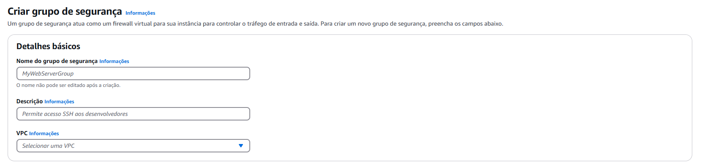

- Criar um grupo de segurança para o servidor web
- Criar um grupo de segurança para o RDS
- 
  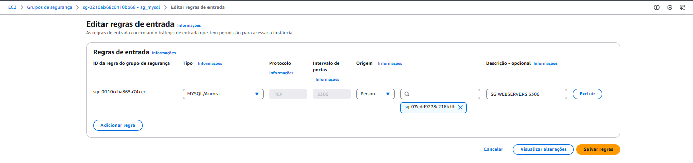
  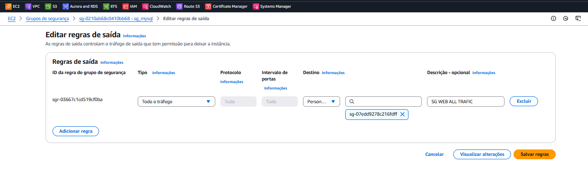

- Criar um grupo de segurança para o EFS.
  
  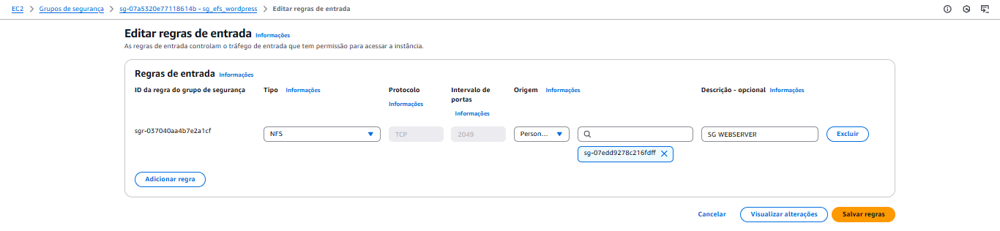
  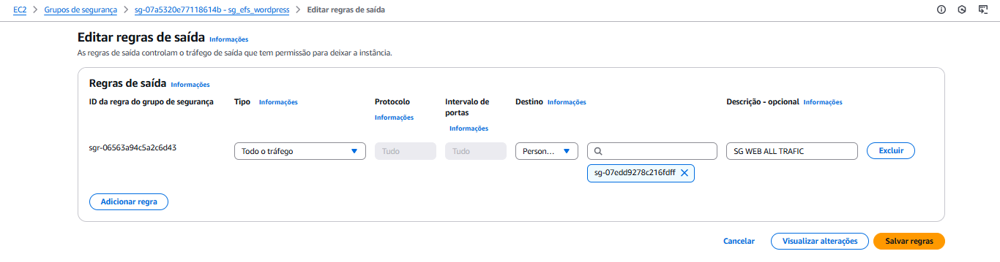

- Criar um grupo de segurança para o LB
  
  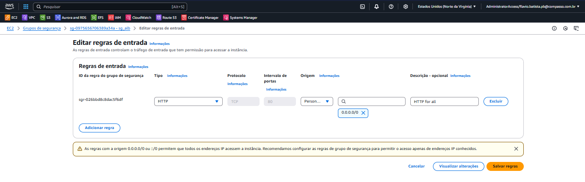
  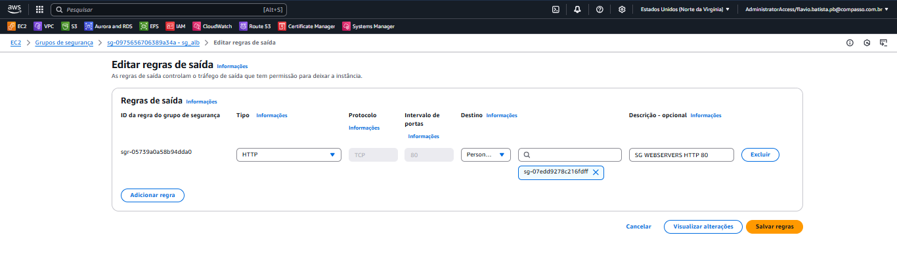

- Editar o grupo de segurança do WebServer que está vazio.

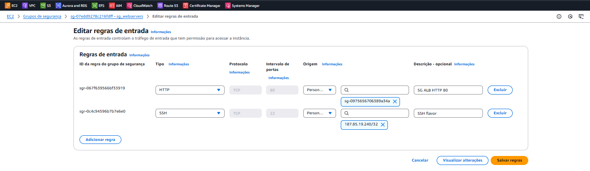
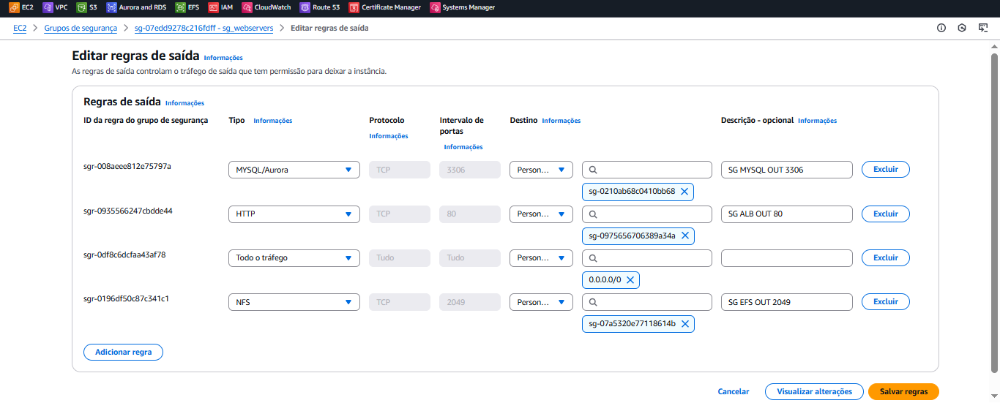

## Criação do EFS

Na página inicial procuramos po "EFS" na barra de pesquisas. Então acessamos ao serviço. Seremos direcionados para uma página onde selecionaremos a opção criar sitemas de arquivos.


Na próxima tela colocaremos o nome, vincularemos a VPC criada para o projeto e clicaremos em personalizar. 


Nas configurações repetiremos o nosso do EFS, tipo de sistema selecionaremos ***regional***, desabilitamos os backups automáticos. No gerenciamento de ciclo de vida deixaremos na opção ***nenhum***.

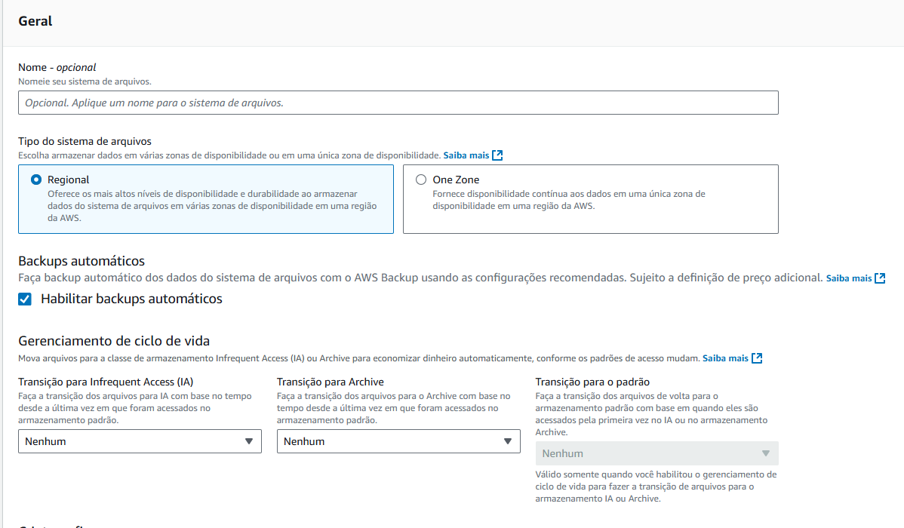

Nas configuraçãoes de performance selecionaremos ***intermitente*** e clicamos em próximo. 

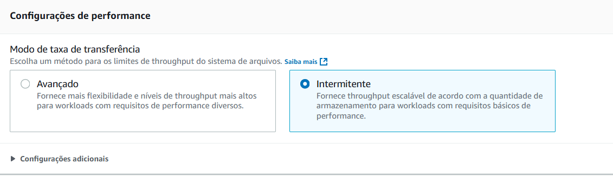

Agora faremos as configurações de rede. Selecionaremos então a VPC que estamos utilizando no projeto, nos destinos de montagem selecionaremos as zonas de disponibilidade 1a e 1b e selecionaremos as subnets privadas de cada zona de disponibilidade e vincularemos as duas ao securuty group do EFS clicamos em próximo. Avançamos até concluir a criação do EFS. 


Avançamos até concluir a criação do EFS, veremos a tela a seguir. 

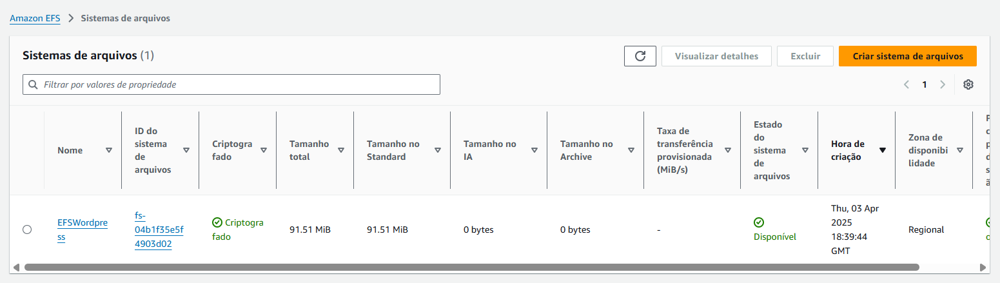

## Criação do RDS

Vamos a tela inicial do console e pesquisamos RDS e clicamos em ***Aurora and RDS***


Clicamos então em ***Banco de dados*** no menu esquerdo e logo depois em ***Criar bancdo de dados***. 


Escolhemos em tipo de mecanismo o banco ***mysql*** e em versão de mecanismo escolheremos a última versão disponível. 


Escolheremos o modelo gratuito. 


Logo depois vamos fazer as configurações do RDS. Escolheremos um nome para o identificador da instância, depois editaremos o nome de usuário, escolheremos as credenciais autogerenciadas e então escolheremos e confirmaremos nossa senha. 


Então mudaremos a classe da instância para ***t3 micro*** e o limite máximo de armazenamento para ***25***


Então configuremos a conectividade do nosso RDS. Selecionaremos a VPC criada para o projeto e negaremos o acesso público. 


Selecionaremos então o Security Group do RDS. Em grupo de segurança selecionaremos ***selecionar existente*** e então o Security Group do RDS.


Antes de finalizar criaremos um nome para o banco de dados e rolaremos até o fim da página e clicaremos em ***criar banco de dados***. 


Finalizadas as configurações seremos direcionados para a seguinte tela. 

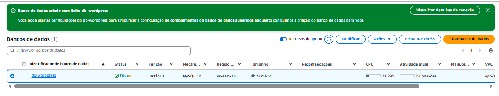

Agora vamos pegar e armazenar o endereço do banco de dados e o ponto de montagem EFS para edição do nosso scripty para o userdata e o docker-compose. 

- RDS
  


-EFS

Abrimos o EFS que criamos e clicamos em anexar. Na próxima tela copiaremos o o assistente de montagem do EFS. 


 Alterar esse userdata && o docker-compose.yml para que contenha suas informações

`userdata`

```#!/bin/bash

# Atualiza os pacotes do sistema
yum update -y

# Instala pacotes necessários
yum install -y ca-certificates wget amazon-efs-utils

# Instala o Docker
yum install -y docker

# Inicia e habilita o serviço do Docker
systemctl enable docker
systemctl start docker

# Adiciona o usuário ec2-user ao grupo docker para evitar uso de sudo
usermod -aG docker ec2 -user

# Instala o Docker Compose manualmente
curl -L "https://github.com/docker/compose/releases/latest/download/docker-compose-$(uname -s)-$(uname -m)" -o /usr/local/bin/docker-compose
chmod +x /usr/local/bin/docker-compose
ln -s /usr/local/bin/docker-compose /usr/bin/docker-compose

# Cria o diretório de montagem do EFS
mkdir -p /data

# Monta o sistema de arquivos EFS
# Substituir pelo mount do seu EFS
sudo mkdir /efs
sudo mount -t efs -o tls fs-04b1f35e5f4903d02:/ /efs

#Pega o docker compose do github
wget -O /home/ec2-user/docker-compose.yml https://raw.githubusercontent.com/JeanPinhata/Projeto-Compass/refs/heads/main/Projeto_3/docker-compose.yml
sudo chown ec2-user:ec2-user /home/ec2-user/docker-compose.yml

# Ajusta permissões do arquivo
chown ec2-user:ec2-user /home/ec2-user/docker-compose.yml

# Inicia os containers com Docker Compose
cd /home/ec2-user && docker-compose up -d
``` 

`docker-compose.yml`

```services:
  web:
    image: wordpress
    restart: always
    ports:
      - "80:80"
    environment:
      WORDPRESS_DB_HOST: seu_endpoint_do_banco_de_dados
      WORDPRESS_DB_USER: o_usuario_do_seu_rds
      WORDPRESS_DB_PASSWORD: sua_senha
      WORDPRESS_DB_NAME: o_nome_da_sua_database
    volumes:
      - /home/ec2-user/pastadesuapreferencia:/var/www/html
    networks:
      - tunel

networks:
  tunel:
    driver: bridge
```

## Criar um modelo de execução. 

Vamos até a página inicial do console e pesquisamos por EC2, no menu lateral esquerdo selecionaremos a opção ***modelo de execução*** e criaremos nosso modelo. Escolheremos o nome e a descrição do nosso modelo e habilitaremos a orientação sobre o Auto Scaling. 


Escolheremos o linux aws e mudaremos o tipo da instância para t2.micro. 


Não escolheremos uma sub-rede especifica e escolheremos o grupo de segurança criado para os servidores web. 


Em Tags de recursos colocaremos as tags que nos foram passadas para criação de instâncias. 


Em detalhes avançados colocaremos o nosso scripty do userdata e criamos o modelo de execução. 


## Criar o Load Balancer. 

No menu lateral da esquerda selecionaremos load balancers e então criar load balancer. Utilizaremos a opção ***Classic Load balancer*** e criar. 


Na próxima página iremos escolher o nome do Load Balancer, deixaremos voltado pra internet, selecionaremos a VPC do projeto e as zonas de disponibilidade e as subnets privadas. 


Agora alteraremos aonde será feito o teste  de HC (por padrão ele vem como "/index.html"). Então criaremos o Load Balancer. 


## Criação do Auto Scaling Group. 

Iremos até o menu lateral esquerdo e selecionaremos a opção Grupos Auto Scaling. Clicaremos em criar e escolheremos o nome, selecionaremos o modelo de execução que acabamos de criar e clicamos em próximo. 


Escolheremos a VPC criada para o projeto e então vincularemos as subnetes publicas de zonas diferentes para o Lounge Template. 


Na próxima página de balanceamento de carga selecionaremos ***Anexar a um balanceador de carga existente***, depois ***Escolher entre Classic Load Balancers*** e escolheremos o que acabamos de criar. 


Em verificações de integridade ativaremos as verificações de integridade do Elastic Load Balancing e clicaremos em próximo. 


Habilitaremos o monitoramento do cloudwatch. Então clicaremos em próximo até finalizar a criação do Auto Scaling. 


5. Testes

Vamos até as intâncias e verificar se elas estão sendo executadas. 


Então acessaremos o DNS do seu LB pelo navegador. Se tudo estiver configurado corretamente será exibida a tela inicial do Wordpress. Escolheremos Português/Brasil e faremos as configuraçãoes de login e acessar a página. 


6. Conclusão
   
Este projeto demonstra a implementação bem-sucedida de uma arquitetura robusta e escalável para hospedar a plataforma WordPress na Amazon Web Services (AWS). Através da utilização de serviços como VPC, RDS, EC2 (com Docker),Load Balancer e Auto Scaling, foi estabelecido um ambiente capaz de oferecer alta disponibilidade, otimização de performance e adaptação à demanda de tráfego.
A conteinerização do WordPress com Docker simplifica a gestão e garante a consistência do ambiente de execução, enquanto o Load Balancer distribui o tráfego de forma eficiente, melhorando a experiência do usuário. A capacidade de escalar automaticamente o número de instâncias EC2 através do Auto Scaling Group assegura que a aplicação possa lidar com picos de acesso sem comprometer a performance ou a disponibilidade, otimizando também os custos em períodos de menor demanda.
A utilização do Amazon RDS como serviço de banco de dados gerenciado proporciona confiabilidade e escalabilidade para o armazenamento de dados do WordPress, liberando recursos para o foco na aplicação em si. A infraestrutura de rede segura e isolada, estabelecida com o Amazon VPC, oferece um ambiente controlado e protegido para a operação da plataforma.
A documentação detalhada deste processo serve como um guia valioso para futuras referências.

7. Agradecimentos. 

Gostaría de expressar minha sincera gratidão à nossa Scrum Master Yurisay e aos instrutores Thiago, Davi e Craus, cuja orientação e paciência foram fundamentais para o esclarecimento de nossas dúvidas ao longo deste projeto. Um agradecimento especial aos amigos Alessandra, Flávio e Gabriel, pela colaboração e apoio que durante todo o processo de execução foram inestimáveis e essenciais para o sucesso deste projeto.

8. Referências

 Documentação Oficial:

- AWS: Informações detalhadas sobre serviços como VPC, RDS, EC2, ALB, ASG.
- Docker: Guia para instalação e uso do Docker.
- WordPress Codex: Documentação sobre instalação e configuração do WordPress.
